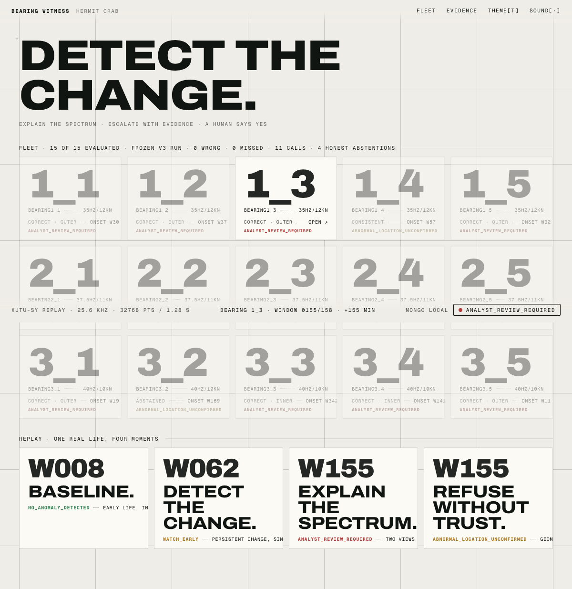
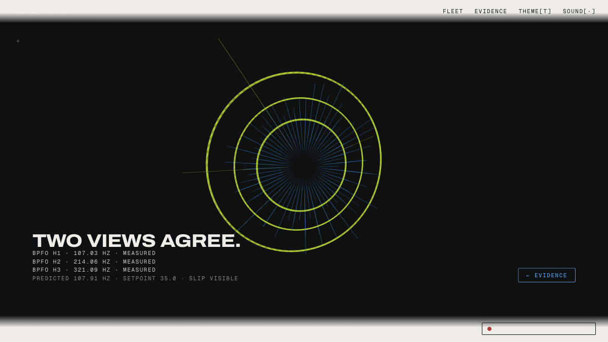

# Bearing Witness

**An always-on, fully local bearing-screening agent on the Dell Pro Max with GB10. Physics does the diagnosis, a local model files the paperwork, and a human has to say yes.**

Built by **Team Hermit Crab** at the Dell x NVIDIA AI Hackathon, New York City, August 22, 2026.

> **In the largest utility motor reliability study ever run, 41% of all failures came down to a part smaller than your fist** (Albrecht et al., IEEE Trans. Energy Conversion, 1986, 6,312 motors). Most plants still check it once a month, by hand, because their vibration data is not allowed to leave the building. This box changes that without moving the data an inch.

## Judge quick access

Every row is checkable with a clone and nothing else. No account, no key, no cloud.

| To verify... | Go here |
|---|---|
| **It reproduces on your machine** | `python3 -m venv .venv && .venv/bin/pip install -r requirements-product.txt && .venv/bin/python -m pytest tests/ bw_product/tests/ -q -rs` (corpus-dependent tests skip with printed reasons) |
| **Zero wrong calls is a committed artifact, not a slide** | [`eval/results_v3.json`](eval/results_v3.json) + [`eval/run_v3_output.txt`](eval/run_v3_output.txt), produced under [thresholds frozen before the run](eval/frozen_thresholds_v3.md) with the freeze sha embedded |
| **The UI boots and shows real verdicts** | `.venv/bin/python -m bw_product.ui` then http://127.0.0.1:8080 (MongoDB optional; the HUD says so honestly when absent) |
| **One window through the whole engine** | `.venv/bin/python -m bearing_witness analyze --root data/XJTU-SY_Bearing_Datasets --condition 35Hz12kN --bearing Bearing1_3 --record 155 --cache-dir eval/feature_cache` prints the 14-field contract JSON |
| **Who built what, when, under what gates** | [`PLAN.md`](PLAN.md), the live four-lane coordination board, timestamps and abandon ladder included |
| **How honest the claims are** | [`TECHNICAL_REFERENCE.md`](TECHNICAL_REFERENCE.md) section 11 disclosure + the [submission draft](docs/SUBMISSION_DRAFT.md) whose every number greps to shipped code |

The live demo runs at the table, on the box, by design: all inference is local and no cloud API sits in the runtime path. That is the product requirement, not a limitation.

## The screens

## Measured results (thresholds frozen before the run)

Frozen v3 evaluation over all 15 XJTU-SY run-to-failure bearings, no exclusions:

| Metric | Result |
|---|---|
| Wrong element calls | **0** |
| Missed detections | **0** (onset detected on 15 of 15) |
| Correct localizations | 10 exact + 1 cage-consistent |
| Honest abstentions | 4 (each carries its machine reason) |
| Warning lead time | median 99 min over 15 (98 excluding one structural floor; min 11, max 2,519) |

When the evidence does not clear the frozen 3-harmonic floor, the system refuses
to guess and says why. The refusal is a feature: there is no approve button on
an untrusted case, and the database's compare-and-set decision gate refuses the
write even if a client renders one.

## How it works

1. **Detect**: persistent change against the asset's own early, condition-matched
   baseline (one-sided modified z, group fusion, 3-window persistence).
2. **Explain**: known machine frequencies are labelled before any residual
   pattern is treated as bearing evidence.
3. **Corroborate**: a suspected fault must agree across the ordinary spectrum
   and the envelope spectrum, at slip-aware search widths.
4. **Escalate**: a typed work order is drafted with evidence locators; a human
   approves, rejects, or defers. Evidence is retained on rejection. Decided
   records are immutable.

## Repository layout

| Path | What |
|---|---|
| `bearing_witness/` | The evidence engine: DSP, detection, trust gate, localization, contract, CLI |
| `eval/` | Frozen thresholds, evaluator, verbatim results over all 15 bearings |
| `bw_product/` | MongoDB store (validated collections, gated writes), NiceGUI evidence UI, engine adapter, always-on watch loop |
| `bearing-witness-tools/` | Six typed OpenClaw tools with confirm-before-mutate and an LLM output post-scan |
| `prep/` | Pre-event analysis harnesses (the v1/v2 history that produced the frozen v3 design) |
| `docs/` | Demo runbook, pitch script, submission draft, review record, build plans, gateway config |
| `PLAN.md` | The four-lane coordination board the team actually ran on |

## Honesty notes

- The Friday-night work is bigger than the word "scaffolding" suggests, and we
  disclose it with timestamps rather than hide it: the engine core, its CLI, the
  threshold freeze (Fri 23:37) and the evaluation run behind every number here
  (Fri 23:44), plus the Mongo store, fixtures, and UI shell, were all built the
  night before doors and are logged as such in PLAN.md's status notes, as the
  event rules allow for starter scaffolds. Built on event day: the GB10
  bring-up, the live wiring and gating on the box, the agent tools and their
  locator-citation gate, the watch loop's resume-from-record, and the demo, all
  visible in Saturday's commit history.
- Every number above comes from the frozen evaluator output committed in this
  repository. Wrong calls and abstentions are reported in the same sentence as
  the wins.
- The UI never renders an invented value: every chart, locator, and lamp state
  traces to a measured record with a sha256. The XJTU-SY dataset (Wang et al.,
  IEEE Trans. Reliability, 2020) is not redistributed here; place it under
  `data/XJTU-SY_Bearing_Datasets/` to run corpus-dependent paths.

## Team Hermit Crab

Stephen Sookra (product loop, MongoDB, UI, demo), Vinh Le (evidence engine,
evaluator), Bharadhwaj K. (GB10 bring-up, inference serving), Jadyn Worthington
(OpenClaw agent surface, OpenShell policy).

MIT License. Built with NVIDIA NemoClaw, OpenClaw, OpenShell, MongoDB Community,
SciPy, and NiceGUI on a Dell Pro Max with GB10.
